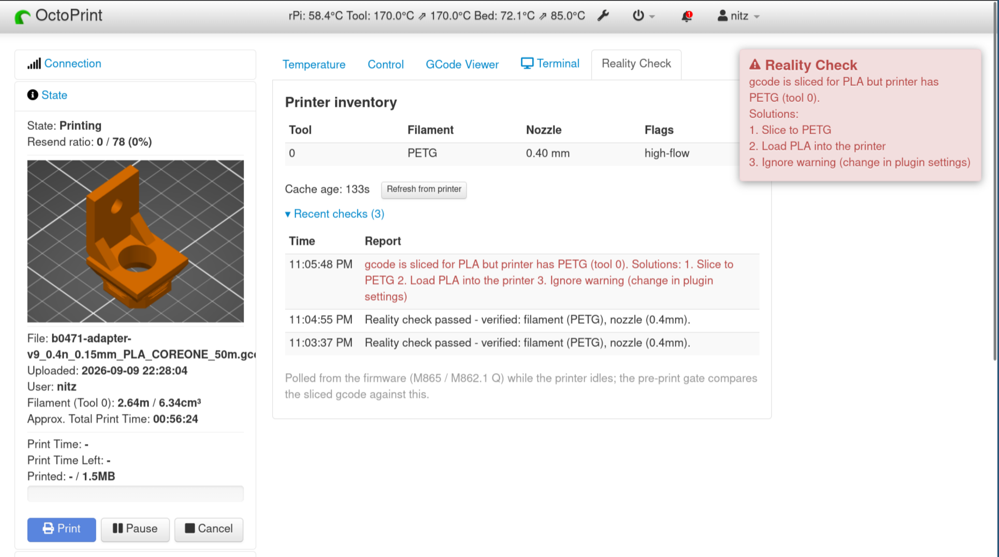
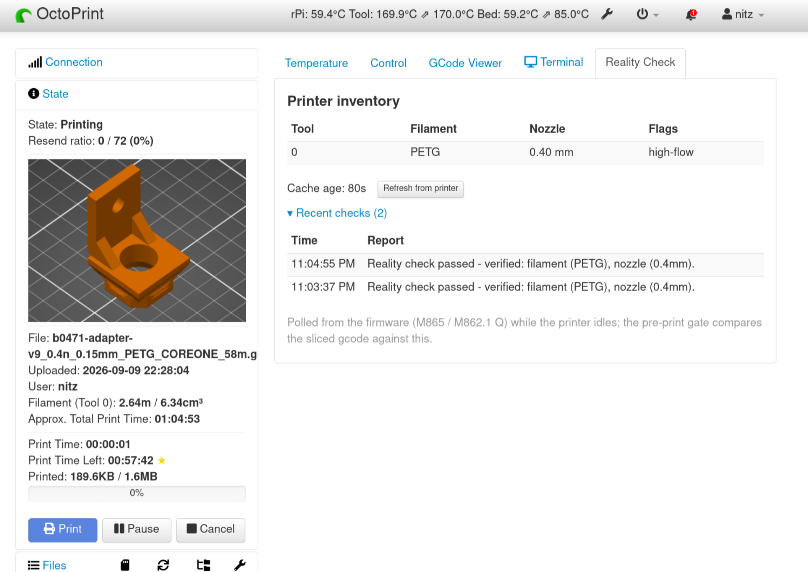
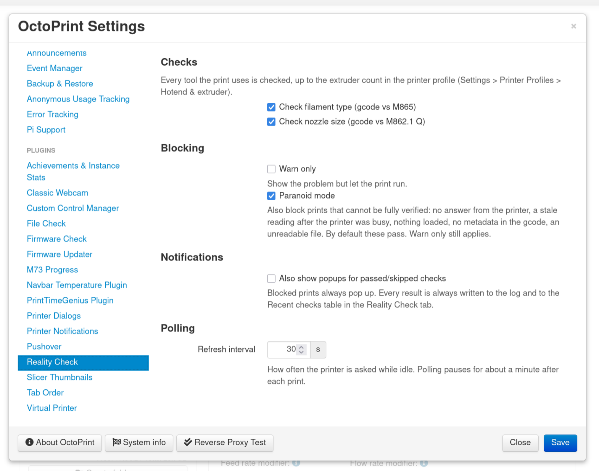
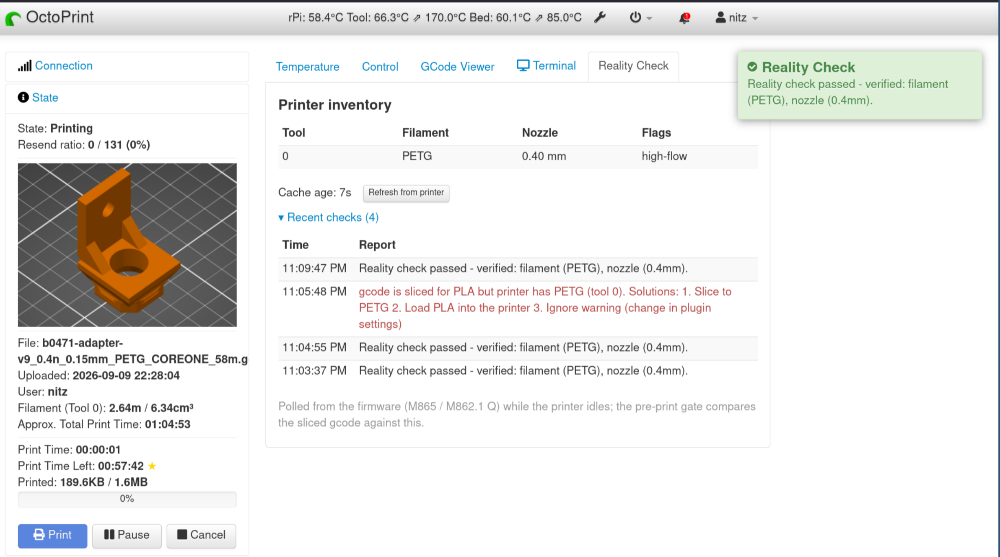

# OctoPrint-Reality-Check

Block a print if the file wants a different setup than what the printer
currently reports.

*A PLA-sliced print blocked and cancelled: the printer reports PETG loaded. The popup names both sides and the ways out.*

Prusa Buddy printers (CORE One, MK4 family, XL...) validate filament type and
nozzle size themselves for **file-based** prints (USB stick, PrusaLink,
Connect), where the firmware can read the file's metadata. Printing over
serial (e.g. OctoPrint) arrives one command at a time and can't have those
checks — the firmware's own `M862.1 P` handler documents the parameter as
"ignored when printing". If you're like me, you'll print a PLA gcode with a
PETG filament loaded and wonder why the print doesn't adhere to the bed.
No more!

Reality Check helps by blocking prints that specify a setup that doesn't
match the printer's report:

1. While the printer idles, it polls the firmware's own state:
   `M865 I<tool>` for the loaded filament type, `M862.1 Q` for the nozzle
   configuration (diameter / hardened / high-flow, from EEPROM).
2. It plugs into OctoPrint's gcode-queuing phase, reads `; filament_type`
   and `; nozzle_diameter` from the file, and compares.
3. On mismatch it cancels the print and pops an error naming both sides
   and the ways out. Can be configured to only warn and let the print
   go through.

The main value here is simplicity. There is no persistence, no spool
database, no companion plugins — world state is read from the printer
itself, so anything that updates the printer's loaded filament (its own
load/change UI, or an external `M865 S"PETG" L0`) feeds the check
automatically. Unexpected states fail open — the plugin only blocks when
it **knows** there's a mismatch — unless you turn on paranoid mode, which
blocks anything it can't fully verify.

A dedicated **Reality Check tab** shows the current printer inventory —
per-tool filament, nozzle (with flags), cache age, a manual refresh
button — plus an event log of recent checks:

*The Reality Check tab during a print: per-tool inventory on top, recent check verdicts below.*

## Requirements

- A Prusa Buddy-firmware printer connected to OctoPrint over serial, with
  `M865` support (check by sending `M865 I0` in the OctoPrint terminal — you
  should get `name:<type>` back).
- Gcode sliced by PrusaSlicer or anything else that writes
  `; filament_type = ...` / `; nozzle_diameter = ...` comments.

## Setup

Install manually using this URL:

    https://github.com/BackSlasher/OctoPrint-Reality-Check/archive/main.zip

## Settings

In the OctoPrint settings dialog (or `config.yaml` under
`plugins.reality_check`):

*The settings panel: check toggles, warn-only, popup level, and the polling interval.*

| key | default | meaning |
|---|---|---|
| `check_filament` | `true` | compare `; filament_type` against `M865` |
| `check_nozzle` | `true` | compare `; nozzle_diameter` against `M862.1 Q` |
| `warn_only` | `false` | pop the mismatch but let the print run |
| `fail_closed` | `false` | paranoid mode: also block prints that can't be fully verified — no printer answer, a used tool with nothing loaded or never polled, missing gcode metadata, unreadable (e.g. SD-card) file. `warn_only` still applies |
| `popup_on_pass` | `false` | also pop pass/skip messages (blocks always pop; everything is always logged and listed in the tab's event table) |
| `refresh_interval` | `30` | seconds between idle polls of the firmware |

With `popup_on_pass` enabled, passing checks announce themselves too, and the
tab's event table keeps the recent history either way:

*A passing check announcing itself (`popup_on_pass` on), with a blocked attempt visible in the event history.*

Tool count follows the printer profile's extruder count — raise it there for
a toolchanger.

## API

- `GET /api/plugin/reality_check` — current cached firmware state plus the
  recent-events list.
- `POST /api/plugin/reality_check` with `{"command": "refresh"}` — poll now.

## Design notes

- **Why a cache, not a live query at print start:** OctoPrint calls the
  queuing hook from its serial send loop — the same loop that would have to
  transmit the query. Waiting there would deadlock, so the gate only reads
  state gathered while the printer idled. The cache can therefore be up to
  one refresh interval old (30 s by default) — enough, in theory, to miss a
  filament swapped just before the print starts. In practice a swap
  (heat, unload, load, purge, confirm the type) takes longer than that, so
  keep `refresh_interval` short. The tab shows the cache age; a refresh that
  gets no answer keeps the old value, so the age keeps growing.
- **Polling pauses right after a print.** OctoPrint reports the printer
  ready as soon as the last lines are acknowledged, while the printer is
  still finishing up (end-script moves and the like) — queries sent then
  went unanswered. So the first ~60 s of timer ticks after a print, done or
  cancelled, are skipped (two ticks at the default interval).
- **How serial "RPC" works here:** OctoPrint has no request/response
  primitive. The plugin tags its query, the `gcode.sending` hook spots the
  tag and opens a capture window just before the line is written (not
  `gcode.sent`: that runs after the write, and a fast reply read on
  OctoPrint's other thread could beat it), and the window closes when a received line
  matches the expected answer (`name:` / `M862.1 T..`). Completion is by
  content, deliberately not by `ok` — stray acknowledgements from in-flight
  commands (e.g. right after a cancelled print) must not close the window
  early. A query that times out keeps the previous cached value; only an
  explicit `name:---` means "nothing loaded".
- Unknown states fail open with an explanatory message: no firmware answer,
  no metadata in the file, or nothing loaded all let the print through — the
  plugin only blocks on a positive contradiction. `fail_closed` (paranoid
  mode) flips this: every one of those blocks the print instead.
- SD-card prints (from OctoPrint's perspective) are not validated; prints
  started on the printer itself from a file get the firmware's own preview
  checks anyway.

## Development

Written with heavy AI assistance (Anthropic's Claude), with a human in the
loop for every design decision, and declared as `ai-developed` in the
OctoPrint plugin repository. Before the first public release the code went
through an adversarial review pass (which caught, among others, an XSS in
the popup path and a metadata-parsing tear — both fixed) and was
field-tested against a real Prusa CORE One: blocked, passed, and
cache-corruption regression scenarios all exercised on hardware.
